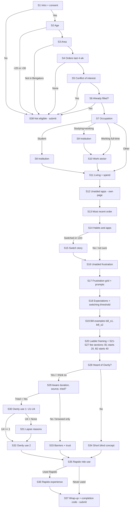

# Bengaluru Survey — Logic, Branches, Timing, Quotas, Channel Tags

**v2, 2026-09-14 (lead length cuts):**
- No choice tasks.
- Removed: dem_gender, beh_weekday_weekend, beh_meal_occasions, beh_last_daytype, beh_last_location, exp_instructions_importance, exp_quality_concern_cheap, own_nps.
- B1/B2 differ experimentally only in the fee-ladder start.

Companion files: `bengaluru_google_form_part1.md` / `_part2.md`, `bengaluru_experimental_modules_note.md`. Wording source: `03_hyderabad_survey/survey_variable_dictionary.csv`.

## 1. Flowchart

S39 (quota-full thank-you) is used only after the unaware cap is reached (§6).

## 2. Branch rules

| Rule | Trigger question | Mechanic |
|---|---|---|
| Screen-outs | 1.5, 2.1, 3.1, 4.1, 5.1, 6.1 | Go to S38 → Submit |
| Occupation routing | 7.1 | Student → S8 → S11; studying+working → S9 → S10 → S11; working → S10 → S11; other → S11 |
| Switch story | 14.7 = Yes | Go to S15, else S16 |
| Refund outcome | 17.4 contains "I asked for a refund" | **Not branchable** (checkboxes) → 17.5 shown to all, with "haven't asked" option (code 0) |
| Fee ladder | Section 20 footer + each fee section | B1 → S23 (₹20); B2 → S25 (₹40); Graphs A/B in `03_hyderabad_survey/wtp_gabor_granger_design.md` §3; END = S28 |
| Ownly awareness | 28.1 O1 = No → S34; Yes / I think so → S29 | Go to section |
| Tried | 29.3 O4 = Yes → S30; No / browsed → S33 | Go to section (O4 last in S29) |
| Lapsed | 30.4 U4 = None → S31 → S32; else → S32 | Go to section (U4 last in S30) |
| Not tried (O5) | 33.1 O5 then 33.2 own_trust | After section S33 → **S35** (Rapido rides) |
| Support resolution | 32.9 U13 contains refund/support | **Not branchable** → 32.10 U14 shown to all users, with code 9 "no issue" |
| Rapido experience | 35.1 R6 = Never used → S37; else → S36 | Go to section |
| Unaware quota full | 28.1 O1 = No | Re-route to S39 (§6) |

**Derived groups (cleaning):**
- `blr_group = current` if O4 = Yes and U4 ≥ 1
- `lapsed` if O4 = Yes and U4 = None
- `aware_never_tried` if O1 ∈ {Yes, I think so} and O4 ∈ {No, browsed}
- `unaware` if O1 = No

## 3. Timing estimate (recomputed item-by-item)

**Assumptions (seconds):**
- single choice / scale 6
- grid row 5
- checkbox 12
- numeric 10
- required open text 35
- optional open text 20 (switch story weighted by ~30% who see it)
- bill image 25
- instruction text 12
- page transition 2
- average 3 ladder screens

The earlier v1 table (≈19 min) was a coarse block guess and is superseded. **The pilot median is the authority**: if it exceeds this estimate by more than 20%, apply the §3a cuts.

| Block | Current user | Lapsed | Aware, never tried | Unaware |
|---|---|---|---|---|
| Intro + screener (S1–S6) | 1.0 | 1.0 | 1.0 | 1.0 |
| About you (S7–S11) | 0.5 | 0.5 | 0.5 | 0.5 |
| Unaided apps + last order (S12–S13) | 2.0 | 2.0 | 2.0 | 2.0 |
| Habits (S14–S15) | 1.0 | 1.0 | 1.0 | 1.0 |
| Frustrations (S16–S17) | 1.8 | 1.8 | 1.8 | 1.8 |
| Expectations (S18) | 0.8 | 0.8 | 0.8 | 0.8 |
| Bill examples (S19) | 0.9 | 0.9 | 0.9 | 0.9 |
| Fee ladder (S20–S27) | 0.6 | 0.6 | 0.6 | 0.6 |
| Ownly awareness + about (S28–S29) | 0.5 | 0.5 | 0.5 | 0.1 |
| Ownly use / lapse / barriers / concept | 2.3 | 2.6 | 0.3 | 1.3 |
| Rapido + wrap-up (S35–S37) | 0.5 | 0.5 | 0.5 | 0.5 |
| **Total** | **≈12.0** | **≈12.3** | **≈10.0** | **≈10.5** |

This meets the ≤13-min target for current users. With a +20% conservative allowance: ≈14.4 current, ≈14.8 lapsed.

### 3a. Further candidate cuts (NOT applied; none are H9/H12 inputs) — use only if pilot median > 14 min

| Item | Hypothesis served | Approx. saving |
|---|---|---|
| beh_last_total_recall | QC sensitivity only | 6 s |
| own_last_total | H2 (Ownly AOV, descriptive) | 10 s |
| meta_comments | none | 20 s |
| exp_late_tolerance | H4 (Hyderabad-confirmatory) | 6 s |
| pain_refund_outcome | H4.2 (exploratory) | 6 s |
| beh_last_restaurant_type | H10 (descriptive) | 6 s |
| pain_unaided_frustration | H1.2 robustness | 20 s |
| **Total** | | **≈1.2 min** |

Any cut must also be applied in Hyderabad, or the item is marked `comparable_with_hyd = no`.

## 4. Quota counters (daily; targets from `00_research_charter/F_sample_plan.md` §3)

| Counter | Rule (combined B1+B2 tab; complete, non-screen-out rows) | Target | Hard min | Action |
|---|---|---|---|---|
| Current Ownly users | O4 = "Yes" AND U4 ≠ "None" | 55 | 30 | Push referral asks to confirmed users |
| Lapsed users | O4 = "Yes" AND U4 = "None" | 20 | 10 | Ask users for friends who "stopped using it" |
| Aware, never tried | O1 ∈ {Yes, I think so} AND O4 ≠ "Yes" | 45 | 20 | — |
| Unaware | O1 = "No" | ≤ 40 (cap) | 10 | Close branch at 40 (§6) |
| Students | seg_occupation_raw ∈ {UG, PG} | ≥ 50 | 35 | — |
| Working professionals | "Working full-time" | ≥ 70 | 45 | — |
| Occasional (1–3 orders) | scr_orders_4wk = "1–3 times" | ≥ 30 | 20 | — |
| B1 vs B2 balance | count by meta_form_version | 50/50 ± 5 pp | — | Check randomiser |
| Any single meta_source | share of complete rows | ≤ 40% | — | Pause that channel |

Screen-outs (rows reaching S38) are counted separately for the sample-flow table.

## 5. Recruitment-channel tagging (`meta_source` = utm_source)

| meta_source | Channel | Flags |
|---|---|---|
| `blr_personal_network` | Team DMs to friends/alumni in Bengaluru | — |
| `blr_linkedin_post` | Team LinkedIn posts | — |
| `blr_linkedin_dm` | Personal-network LinkedIn messages (no automation) | — |
| `blr_reddit_bangalore` | r/bangalore / r/bengaluru post (mod approval) | — |
| `blr_reddit_ownly_thread` | Link in an Ownly-topic thread (where rules allow) | `ownly_topic_channel = 1` (sensitivity exclusion) |
| `blr_college_groups` | Admin-approved college WhatsApp/Telegram groups | — |
| `blr_workplace_groups` | Insider shares in office groups | — |
| `blr_snowball` | End-of-survey share link | Clustered; cap 3 referrals per person |
| `blr_company_facilitated` | Any help from Ownly/Rapido | Label "company-facilitated"; analyse separately |
| `blr_qa` | Team testing | Exclude |

Link format: `link_randomizer.html?city=blr&utm_source=<value>&utm_campaign=blr_wave1`.

## 6. Closing the unaware branch at quota (40)

Forms has no quotas, so do this manually in **B1 and B2 together**:

1. Section **S39 "Thank you (quota full)"** already exists (built unused; After section → Submit form).
2. In both copies, on 28.1 (O1), change the go-to for **"No"** from S34 to **S39**. Pain, expectation, bill and fee-ladder data were already answered, so they are kept. Only the short concept (34.x) and Rapido items (35–36) are lost for later unaware respondents.
3. Log the date/time and the unaware count at the switch in `decisions.md`.
4. Never delete S34. Revert the go-to to reopen it if the quota needs topping up.
