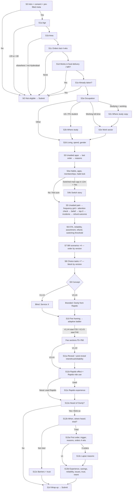

# Hyderabad Survey — Logic, Timing & Quota Monitoring

Build detail: `hyderabad_google_form_part1.md`, `part1b`, `part2`, `part2b`. Variables: `survey_variable_dictionary.csv`.

## 1. Section flow

**Branches in plain text:**
- Screen-outs happen at consent, age, area, orders, conflict of interest and repeat.
- Occupation decides which of S2b / S2c / S2e appear.
- Switch story (S4b) only if the main app changed in the last 12 months.
- The refund outcome (Q42) and Ownly issue resolution (Q98) are **always shown** with a "not applicable" option, because Google Forms cannot branch on checkboxes.
- Module content differs by version: bill order, choice block, concept text, ladder start, and S11a presence. The post-reveal items `br_trial_intent`, `br_trust` and `br_expected_reliability` appear in V1/V2 only.
- Pre-filled meta fields are on page 1 (S0), so screened-out rows keep their token and source.

**Analysis note — brand-exposure contamination (lead decision 2026-09-14).** "Ownly app" and "Rapido app (food section)" appear in platform lists (Q15, Q29, Q30) before the blind concept. This is accepted. `HYD_UNAWARE` (the primary population for interpreting H7) excludes anyone who shows prior exposure by **any** of these:
1. unaided mention in Q13 `beh_unaided_apps`
2. aided awareness Q78 `own_aware_aided` = "Yes, clearly" or "I think so"
3. selecting Ownly app or Rapido app (food section) in Q15, Q29 or Q30

**Duplicate `own_trust`:** Q83 and Q100 sit on mutually exclusive branches and merge into one variable (rule in `hyderabad_google_form_part2b.md`).

## 2. Estimated timing (median respondent, mobile)

After the lead's length cuts (Q17 `beh_last_daytype` and Q18 `beh_last_location` removed, 2026-09-14). Estimates assume about 6 s per closed item, 20–30 s per open text, 20 s per choice task, and 20 s per bill scenario. **The pilot must replace these estimates with measured medians.**

| Section | Items | Main path, non-user: V1/V2 (blind) | Main path, non-user: V3/V4 (branded) | Aware, not tried (add to main) | Ownly user (add to main) |
|---|---|---|---|---|---|
| S0 Intro + consent | 1 + reading | 0.7 | 0.7 | — | — |
| S1 Screener (5 pages) | 5 | 0.6 | 0.6 | — | — |
| S2 About you | 4–5 | 0.6 | 0.6 | — | — |
| S3 Last order (open unaided apps + 11 closed + amount) | 12 | 2.2 | 2.2 | — | — |
| S4 Habits (switch story adds +0.4 for ~25%) | 9 (+1) | 1.3 | 1.3 | — | — |
| S5 Frustrations (open + 9-row grid + 4) | 5 + grid | 1.8 | 1.8 | — | — |
| S6 Expectations | 9 | 1.4 | 1.4 | — | — |
| S7 Bill scenarios | 4 | 1.5 | 1.5 | — | — |
| S8 Choice tasks (warm-up + 7 task pages) | 7 | 2.6 | 2.6 | — | — |
| S9 Concept | 7 | 1.2 | 1.2 | — | — |
| S10 Fee ladder | 2–5 | 0.6 | 0.6 | — | — |
| S11a Reveal (V1/V2 only) | 3 | 0.4 | — | — | — |
| S11b/c Rapido | 3–4 | 0.4 | 0.4 | — | — |
| S12a Heard of Ownly | 1 | 0.1 | 0.1 | — | — |
| S12b + S12c awareness detail, barriers, trust | 5 | — | — | +0.8 | +0.4 (S12b only) |
| S13a/b/c Ownly user module | 16–17 | — | — | — | +2.6 |
| S14 Wrap-up | 2 | 0.3 | 0.3 | — | — |
| **Total** | | **≈ 15.7** | **≈ 15.3** | **≈ 16.5 / 16.1** | **≈ 18.7 / 18.3** |

**The main path is still over 15 min**, so further cuts are **proposed below; none has been applied**. None of them is an input to a ★ hypothesis, and none is a measure the brief requires.

- **Excluded from cutting — ★ inputs:** PPI items, `pain_top_frustrations`, `bt_trial_intent`, `dec_habit_lock`, `beh_platforms_used_4wk`, `beh_switch_savings_required`, `exp_fav_restaurant_needed`, S8 choice tasks, S10 fee ladder, awareness/tried items, and the H12.1 `own_*` predictors.
- **Excluded from cutting — brief-mandated:** weekday/weekend (Q27), meal occasions/time of day (Q16, Q28), subscriptions, offer dependency, delivery instructions (Q49), food-quality concern (Q50), trust, ETA/reliability/refund expectations, basket and spend.

| Rank | Proposed cut | Est. saving (min) | Hypothesis value | Why it is low value |
|---|---|---|---|---|
| 1 | Q25 `beh_last_fees_noticed` (10-option checkbox) | 0.3 | Descriptive fee salience; no hypothesis test | Audit measures fees directly; PPI covers fee pain |
| 2 | Q75 `br_rapido_effect_why` (optional open text) | 0.3 | H7.3 exploratory qualitative | Interviews cover brand reasons in more depth |
| 3 | Q34 `beh_compare_freq` | 0.1 | No test pre-registered | Overlaps `dec_habit_lock` and multi-homing |
| 4 | Q21 `beh_last_restaurant_type` | 0.1 | H10 descriptive only | H10.2 uses Q47 restaurant types needed |
| 5 | Q67 `bt_expected_price` | 0.1 | Credibility check; no ★ | Proposition price credibility can come from interviews |
| 6 | Q12 `dem_gender` (optional) | 0.1 | Sample description only | Not used in any test |
| 7 | Q36 `beh_switch_reason` (optional open text, ~25% see it) | 0.1 (average) | RQ3 qualitative | Interviews collect switching episodes |
| **Total if all 7 applied** | | **≈ 1.1** | | Main path ≈ 14.2–14.6 min |

**Next step if the pilot median is still > 15 min:** reduce the bill scenarios from 4 to 3 by dropping `bill_s3`. `bill_s4` would then lose its within-person baseline. This needs a lead decision, because it affects H2/H3 convergence.

## 3. Quota and quality counters to monitor daily

Monitored from the linked Sheets, by version tab (targets in `00_research_charter/F_sample_plan.md` §2):

| Counter | Formula / source | Target / alarm |
|---|---|---|
| Starts by version | Rows per tab | V1–V4 each 20–30% |
| Screen-out rate by `meta_source` | Rows with blank Q7 ÷ all rows | Alarm > 40% in a channel |
| Valid completes | Q103 answered, attention check = Rarely | Target 220 |
| `seg_occupation` | Q7 | Student 100 (min 80) · professional 100 (min 80) · working student ≤ 25 |
| `seg_freq` | Q4 | Frequent 70 · regular 80 · occasional 70 (mins 55/55/50) |
| Occupation × freq cross-cells | Q7 × Q4 | ≥ 30 per cell (min 25) |
| Gachibowli core share | Q3 ∈ {Gachibowli, Financial District} | ≥ 50% (min 40%) |
| IIIT-H respondents | Q8 = IIIT Hyderabad | Cap 45 |
| Any single `meta_source` | Share of valid | ≤ 35% |
| Brand arms | (V1+V2) vs (V3+V4) | Within 45/55 |
| Choice blocks | (V1+V3) vs (V2+V4) | Within 45/55 |
| Ownly triers | Q81 = Yes | Aim ≥ 30 |
| Attention fails | Q38.6 ≠ Rarely | Alarm > 15% |
| Direct-link responses | Blank `meta_session_token` | Alarm > 5% |
| Median duration | Submit timestamp − `meta_start_ts` | Alarm < 7 min |
